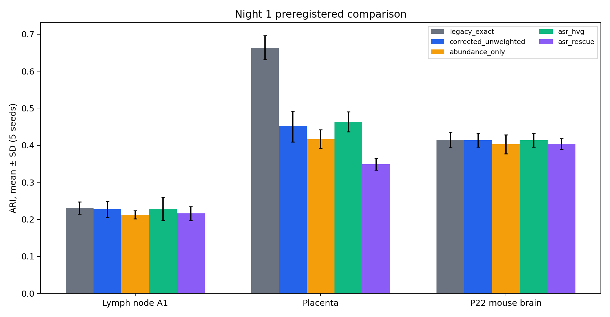
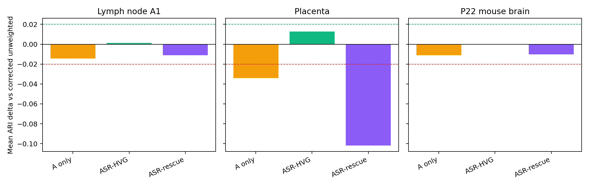
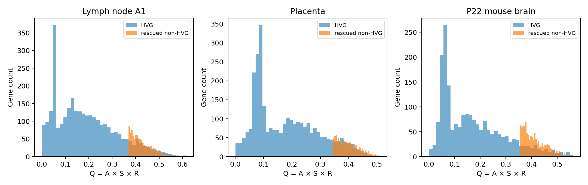
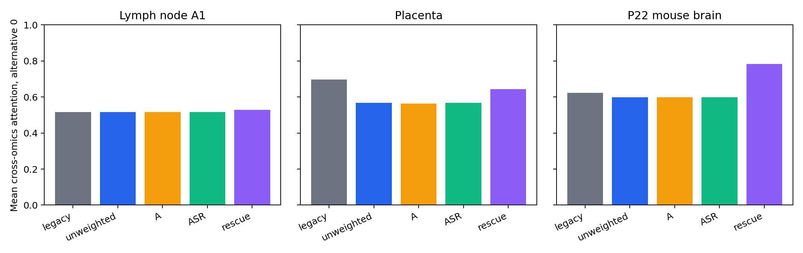

# SpaLORA Q2 Revision — Night-1 Report

## A. Executive result

- Branch: `revision/q2-night1-20260808`; recoverable public-code tag: `baseline/pre-q2-revision-20260808`; original public commit: `323cc0ec7317ddf96c4fd83ab85b919553d1e5d6`.
- Implemented/experiment commits before this report: `e4333a2` (harness), `3044b64` (corrected ASR/sparse implementation), and `a24b0d0` (summaries/diagnostics). The report is committed in the following final experiment-report commit.
- Push status: an HTTPS push was attempted after the implementation commits, but AutoDL had no GitHub username/token available (`fatal: could not read Username for 'https://github.com': terminal prompts disabled`). A final non-interactive retry is made after committing this report; local commits and all artifacts remain on the persistent disk regardless.
- Legacy reproduction: the unmodified Human Placenta Tutorial executed completely as the pre-refactor smoke test. The exact legacy scientific path then completed 3 datasets × 5 seeds.
- Priority A completion: all five variants (`legacy_exact`, `corrected_unweighted`, `abundance_only`, `asr_hvg`, `asr_rescue`) completed on all three datasets and all seeds `[0,1,2,3,4]`: 75/75 runs, 0 failed runs.
- Verdict: **ASR is not supported yet as a performance improvement.** `asr_hvg` is mixed (small positive mean ARI on placenta, essentially neutral on A1/P22), while fixed top-1000 non-HVG rescue reduced mean ARI on all three datasets. No parameter was changed after observing labels or ARI.

## B. Data audit

| Dataset | RNA input | Modality 2 | Locations | Ground truth | K | Alignment / notes |
|---|---|---|---:|---|---:|---|
| Human Lymph Node A1 | `/root/autodl-fs/Human lymph node/A1/humanlymphnode_rna.h5ad`, 3484 × 18085, sparse integer-like counts | `/root/autodl-fs/Human lymph node/A1/humanlymphnode_adt.h5ad`, 3484 × 31 count-like ADTs | 3484 trained/evaluated | `/root/autodl-fs/Human lymph node/A1/A1_groundtruth.csv`, `manual-anno` | 10 | Paired IDs/order and coordinates match. CSV IDs match after the documented removal of the h5ad-only `s1-` prefix. The designated CSV was preferred over `obs.final_annot`. |
| Human Placenta | `/root/autodl-fs/Human placenta architecture/humanplacenta_rna.h5ad`, 1662 × 36601, sparse integer counts | `/root/autodl-fs/Human placenta architecture/humanplacenta_atac.h5ad`, 1662 × 63 continuous TF-related/ATAC-derived features | 1662 trained/evaluated | RNA `obs["cell_type"]` | 10 | IDs/order and coordinates match exactly. The 63 features include TF names such as TFAP2C, TP63 and TEAD4; they are **not described as 63 raw ATAC peaks**. Their provenance/preprocessing needs follow-up verification. |
| P22 Mouse Brain | `/root/autodl-fs/P22 mouse brain coronal section/mousebrain_rna.h5ad`, 9215 × 22914, sparse integer-like counts | `/root/autodl-fs/P22 mouse brain coronal section/mousebrain_atac.h5ad`, 9215 × 121068 transformed ATAC features with deposited 50-dimensional `X_lsi` | 9215 input; legacy `min_genes=200` retains 9196 trained/evaluated | `/root/autodl-fs/P22 mouse brain coronal section/MouseBrain_groundtruth.csv`, `manual-anno` | 9 | Paired full inputs match by ID/order and coordinates. The 19 locations removed by the preserved RNA QC are also the locations not present in the expert CSV, leaving an exact 9196-ID evaluation alignment. |

The input `.h5ad` and CSV files were read only and never modified. SHA-256 hashes, shapes, dtypes, columns, class counts and alignment counts are in `reports/night1_environment.json`.

Environment: host `autodl-pro-78617928975f`; NVIDIA GeForce RTX 4080 SUPER (32760 MiB), driver 595.71.05, host-reported CUDA 13.2. Corrected runs used Python 3.8.10, PyTorch 2.0.0+cu118, Scanpy 1.9.1, AnnData 0.8.0, NumPy 1.22.3, SciPy 1.8.1, pandas 1.4.2 and sklearn 1.1.1. Exact legacy runs used the same core stack with PyTorch 1.12.1+cu116. Both used R 4.0.3, rpy2 3.4.1 and mclust 6.1.1. PyG was not installed and is not imported by the public implementation used here.

Before work, the dirty original worktree was preserved without cleaning at `/root/autodl-fs/night1_preexisting_20260808/` with status, patch, manifests and checksums. Night-1 work ran in the separate clean worktree `/root/autodl-fs/SpaLORA-night1`.

## C. Bugs found and fixes

| Issue | Observed behavior | Corrected implementation | Guard |
|---|---|---|---|
| Abundance representation | Legacy tutorials set `raw_feat` only after normalize/log/z-scale; per-gene means are approximately zero and are not abundance. | `SpaLORA/night1_pipeline.py` keeps immutable `counts`, sparse `X_log=log1p(10000*C/library)` and selected/scaled `X_model` separate. A/S/R use only pre-scale representations. | Count immutability and representation tests; explicit variable names; source data remains read only. |
| Percentile rank | `torch.argsort(avg_expr) / n_genes` is an ordered index array, not gene-aligned ranks. | Tie-aware gene-aligned percentile ranks; `A=1-rank(mean(X_log))`. | A three-gene inverse-rank test verifies alignment and direction. |
| Dense adjacency | Legacy preprocessing densifies N×N graphs and later converts back to sparse. | Corrected variants symmetrize, remove diagonals, add self-loops and normalize entirely in scipy sparse, then construct coalesced PyTorch sparse tensors. | A 2000-location graph test checks sparse types and bounded `nnz`; no corrected `.toarray()` path. The frozen legacy path intentionally remains unchanged. |
| Implicit attention axis | Legacy `F.softmax()` omits `dim` and emits a deprecation warning. | `torch.softmax(scores, dim=1)` over the two alternatives per location. | All three `[N,2]` attention outputs are asserted per run; all 75 runs have maximum row-sum error ≤ 1.1921e-7. |
| Feature-graph specification mismatch | Public code uses correlation while the manuscript describes Euclidean distance. | Feature metric is a config field; Night-1 keeps `correlation` for controlled comparison and records it. | Unit test demonstrates metric configurability. Scientific choice remains open. |
| Weighted loss scale | Legacy computes a global mean after multiplying by arbitrary legacy weights, changing RNA loss scale. | Corrected variants use `sum_g(w_g*MSE_g)/sum_g(w_g)`; uniform weights equal ordinary MSE. | Analytical tensor test for uniform and weighted cases. |
| Label leakage / reproducibility | Labels and run configuration were not structurally isolated in a shared benchmark. | Training copies drop all observation metadata; labels are loaded in the evaluation module only after embedding and mclust predictions exist. Fixed config, five seeds, serialized outputs and Git/config hashes were added. | Source-order guard plus 13 passing tests/assertions, deterministic smoke, ID/coordinate assertions, and exact 75-file completeness validation. |

ASR is exactly preregistered: `A=1-percentile_rank(mean X_log)`, negative Moran's I clipped to 0 then tie-aware ranked as `S`, `R=n/(n+20)`, `Q=A*S*R`, and `w=1+Q` (`alpha=1`). Scores are finite and in `[0,1]`; weights are in `[1,2]`. `asr_rescue` adds exactly the top 1000 non-HVG genes by Q after `min_cells=10`, with selected-name/weight order assertions.

## D. Main results table

Values are mean ± sample SD over all five seeds. Macro-F1 is calculated only after Hungarian assignment; partition metrics use unmapped cluster IDs. Neighbor agreement is the fraction of directed spatial-kNN edges whose endpoints share the predicted cluster. Runtime is total pipeline wall time, not training-only time.

| Dataset | Variant | ARI | NMI | AMI | FMI | Hungarian macro-F1 | Spatial neighbor agreement | Total seconds | Peak GPU MiB |
|---|---|---:|---:|---:|---:|---:|---:|---:|---:|
| A1 | legacy_exact | 0.2304 ± 0.0164 | 0.3644 ± 0.0107 | 0.3604 ± 0.0107 | 0.3737 ± 0.0141 | 0.3307 ± 0.0190 | 0.5993 ± 0.0128 | 19.22 ± 1.95 | 361.25 ± 0.00 |
| A1 | corrected_unweighted | 0.2269 ± 0.0217 | 0.3645 ± 0.0132 | 0.3605 ± 0.0133 | 0.3689 ± 0.0204 | 0.3234 ± 0.0214 | 0.5965 ± 0.0218 | 18.37 ± 1.20 | 417.66 ± 0.32 |
| A1 | abundance_only | 0.2125 ± 0.0111 | 0.3635 ± 0.0087 | 0.3594 ± 0.0087 | 0.3544 ± 0.0117 | 0.3159 ± 0.0146 | 0.5755 ± 0.0097 | 18.65 ± 1.22 | 417.66 ± 0.32 |
| A1 | asr_hvg | 0.2283 ± 0.0312 | 0.3680 ± 0.0160 | 0.3640 ± 0.0161 | 0.3724 ± 0.0327 | 0.3197 ± 0.0273 | 0.6024 ± 0.0266 | 18.01 ± 1.07 | 417.66 ± 0.32 |
| A1 | asr_rescue | 0.2158 ± 0.0189 | 0.3620 ± 0.0117 | 0.3580 ± 0.0117 | 0.3576 ± 0.0188 | 0.3087 ± 0.0174 | 0.5729 ± 0.0185 | 21.65 ± 2.85 | 529.85 ± 0.00 |
| Placenta | legacy_exact | 0.6635 ± 0.0323 | 0.7238 ± 0.0179 | 0.7202 ± 0.0181 | 0.7233 ± 0.0267 | 0.6114 ± 0.0212 | 0.4400 ± 0.0086 | 12.71 ± 0.40 | 198.00 ± 0.00 |
| Placenta | corrected_unweighted | 0.4506 ± 0.0415 | 0.5289 ± 0.0295 | 0.5226 ± 0.0299 | 0.5428 ± 0.0354 | 0.5020 ± 0.0425 | 0.4913 ± 0.0196 | 14.28 ± 1.68 | 255.09 ± 0.00 |
| Placenta | abundance_only | 0.4167 ± 0.0249 | 0.5071 ± 0.0205 | 0.5006 ± 0.0208 | 0.5135 ± 0.0213 | 0.5049 ± 0.0199 | 0.4878 ± 0.0178 | 13.76 ± 0.76 | 255.09 ± 0.00 |
| Placenta | asr_hvg | 0.4633 ± 0.0271 | 0.5381 ± 0.0147 | 0.5320 ± 0.0149 | 0.5535 ± 0.0228 | 0.5239 ± 0.0239 | 0.4824 ± 0.0185 | 14.10 ± 0.43 | 255.09 ± 0.00 |
| Placenta | asr_rescue | 0.3488 ± 0.0160 | 0.4542 ± 0.0189 | 0.4470 ± 0.0191 | 0.4564 ± 0.0116 | 0.4819 ± 0.0145 | 0.4958 ± 0.0191 | 14.88 ± 0.47 | 306.75 ± 0.00 |
| P22 | legacy_exact | 0.4144 ± 0.0211 | 0.5538 ± 0.0152 | 0.5531 ± 0.0153 | 0.5066 ± 0.0181 | 0.5340 ± 0.0110 | 0.8262 ± 0.0176 | 72.59 ± 0.91 | 723.21 ± 0.00 |
| P22 | corrected_unweighted | 0.4138 ± 0.0185 | 0.5527 ± 0.0136 | 0.5519 ± 0.0136 | 0.5065 ± 0.0161 | 0.5330 ± 0.0111 | 0.8263 ± 0.0177 | 66.73 ± 0.88 | 763.02 ± 0.00 |
| P22 | abundance_only | 0.4027 ± 0.0259 | 0.5515 ± 0.0131 | 0.5507 ± 0.0131 | 0.5005 ± 0.0167 | 0.5267 ± 0.0224 | 0.8328 ± 0.0124 | 67.62 ± 0.89 | 763.02 ± 0.00 |
| P22 | asr_hvg | 0.4138 ± 0.0183 | 0.5527 ± 0.0135 | 0.5519 ± 0.0136 | 0.5065 ± 0.0159 | 0.5331 ± 0.0111 | 0.8261 ± 0.0176 | 66.93 ± 0.45 | 763.02 ± 0.00 |
| P22 | asr_rescue | 0.4036 ± 0.0148 | 0.5375 ± 0.0142 | 0.5367 ± 0.0142 | 0.4972 ± 0.0126 | 0.5180 ± 0.0083 | 0.8014 ± 0.0148 | 79.68 ± 2.08 | 1054.78 ± 0.47 |

Complete scalar per-seed metrics are in `results/night1/per_seed_metrics.csv`; per-domain F1 is in `results/night1/per_domain_f1.csv`; every raw JSON, cluster assignment and attention array is under `results/night1/raw/<dataset>/<variant>/seed_<n>/` on the persistent disk. The summary also contains homogeneity, V-measure, balanced accuracy, predicted-cluster Moran's I, silhouette, Davies–Bouldin, preprocessing/training/clustering times and process RSS. Peak reserved GPU memory was not separately captured; peak allocated memory is reported.

## E. Delta table

All deltas below are differences in five-seed means versus `corrected_unweighted` on the same dataset.

| Dataset | Variant | Δ ARI | Δ macro-F1 | Δ neighbor agreement |
|---|---|---:|---:|---:|
| A1 | abundance_only | -0.0144 | -0.0075 | -0.0210 |
| A1 | asr_hvg | +0.0014 | -0.0037 | +0.0059 |
| A1 | asr_rescue | -0.0111 | -0.0147 | -0.0236 |
| Placenta | abundance_only | -0.0340 | +0.0028 | -0.0035 |
| Placenta | asr_hvg | +0.0126 | +0.0219 | -0.0089 |
| Placenta | asr_rescue | -0.1018 | -0.0201 | +0.0045 |
| P22 | abundance_only | -0.0111 | -0.0063 | +0.0065 |
| P22 | asr_hvg | +0.0000 | +0.0001 | -0.0001 |
| P22 | asr_rescue | -0.0102 | -0.0150 | -0.0249 |

The exploratory gate (≥0.02 mean ARI gain on at least two datasets without >0.02 loss on the third) was not met. The result also argues against low abundance alone: `abundance_only` reduced mean ARI on every dataset. P22's slightly higher neighbor agreement under abundance-only coincided with lower supervised partition scores, so it is not evidence of better domain recovery.

## F. Low-abundance/ASR diagnostics

After `min_cells=10`, A1, placenta and P22 scored 17954, 19172 and 16304 genes respectively. `asr_rescue` selected 3000+1000, 3000+1000 and 2000+1000 genes. The 1000 additions were always non-HVG and chosen without labels.

| Dataset | A range | S range | R range | Q range (mean) | Weight range (mean) |
|---|---:|---:|---:|---:|---:|
| A1 | 0–1 | 0.0879–1 | 0.3333–0.9943 | 0–0.6159 (0.1690) | 1–1.6159 (1.1690) |
| Placenta | 0–1 | 0.2020–1 | 0.3333–0.9880 | 0–0.5104 (0.1522) | 1–1.5104 (1.1522) |
| P22 | 0–1 | 0.1286–1 | 0.3333–0.9978 | 0–0.5634 (0.1595) | 1–1.5634 (1.1595) |

S does not necessarily start at zero because many negative Moran values are clipped to the same zero and receive the tie-averaged percentile rank. All declared bounds were verified. Full tables with the required columns (`gene`, `mean_log_abundance`, `detection_count`, `detection_rate`, `morans_I`, `A_score`, `S_score`, `R_score`, `Q_score`, `final_weight`, `is_hvg`, `is_asr_rescued`) are in `results/night1/interpretability/` on persistent storage.

Top 20 rescued non-HVGs by Q:

- A1: ITIH3, KIF18B, TMEM72, KRTAP4-6, LCE3C, IL36B, TYRO3, TMEM26, CRLF1, PRSS51, TMEM132B, CCL1, LAMB3, TNNC1, CASP14, PTH2, ANKRD62, SLC17A4, MLXIPL, PCDHA12.
- Placenta: AC100821.2, EPN3, TRAIP, SCAT2, ANGPTL3, AC016644.1, ECT2L, IFNLR1, HOXB4, AC020891.3, AL024474.2, ZNF460-AS1, APOA1-AS, HIST1H2BE, C6orf141, AC005224.3, USP51, GINS3, TNFAIP8L3, GSEC.
- P22: Gpr149, Gm22567, Igfbpl1, Aspm, Dlx2, Il23a, Dnah11, Ddr2, Rasd1, Peg10, Enkur, Zic5, Cdca7, Htr4, Clic6, Susd5, Hcrtr2, Fzd7, Scn5a, Prlr.

Some names are biologically plausible in context (for example the immune chemokine CCL1 in A1 and neurodevelopment/receptor genes Dlx2, Zic5, Htr4 and Hcrtr2 in P22), but no enrichment, differential-expression validation or external marker audit was performed. They are diagnostic candidates, not biological claims.

## G. Attention diagnostics

Every run exported `alpha_omics1` (RNA spatial vs feature graph), `alpha_omics2` (modality-2 spatial vs feature graph), and `alpha` (RNA vs modality 2), each shaped `[N,2]`. Alternative 0 is spatial for the within-modality attentions and RNA/omics-1 for cross-omics attention. All 75 × 3 arrays passed the row-sum check; global maximum deviation from one was 1.1921e-7.

For `asr_rescue`, mean cross-omics RNA attention was 0.5287 ± 0.0069 across seeds on A1, 0.6441 ± 0.0224 on placenta, and 0.7820 ± 0.0347 on P22. RNA spatial-graph attention was 0.4978, 0.4774 and 0.7256; modality-2 spatial-graph attention was 0.5050, 0.4999 and 0.7496. P22 therefore placed substantially more weight on RNA and spatial views, but seed-level means remained reasonably stable. Full summaries are in `results/night1/attention_summary.csv`.

Per-dataset `asr_rescue` seed-0 predicted-cluster maps are `figures/night1/a1_asr_rescue_spatial.png`, `placenta_asr_rescue_spatial.png`, and `p22_asr_rescue_spatial.png`. They use predicted clusters only, not ground-truth colors.

## H. Failures and open questions

- Scientific sweep failures: none. All 75 required runs exited successfully; no `failure.json` remains.
- Preparatory issues caught and fixed: Python 3.8 lacks `str.removeprefix`; the environment-capture helper now uses compatible slicing. R executables were located inside the conda environments while `R_HOME` remains the working compatibility symlink. A Windows console rendered the P22 en-dash data-type string as mojibake; the UTF-8 source bytes were inspected and the exact `spatial ATAC–RNA-seq` value was used. The first diagnostic P22 plot assumed 9215 rows; its assertion exposed the preserved 19-location QC subset, and plotting now aligns explicitly by observation ID.
- Git push is blocked only by missing GitHub HTTPS credentials on AutoDL. No force-push or alternate credential guessing was attempted.
- The large placenta regression from legacy (ARI 0.6635) to corrected-unweighted (0.4506) requires causal follow-up. Legacy arbitrary gene-index weights also inflate the unnormalized RNA reconstruction term, so this is plausibly a loss-scale/preprocessing interaction rather than evidence for the legacy abundance claim. It must not be “fixed” by label-guided retuning.
- A1 remains around 0.23 ARI; the taskbook's cited 2026 same-benchmark range of roughly 0.30–0.34 is not directly comparable across preprocessing/protocols, but it is a warning signal.
- `asr_rescue` consistently hurt the three anchors and used more memory/time. A matched random non-HVG rescue control was not run; it belongs in the next controlled phase rather than being added after seeing these results.
- Placenta modality-2 provenance is unresolved. The file contains 63 continuous TF-related features rather than raw peaks.
- CPU RSS is the process high-water mark and is conservative for later runs in the same process. Peak allocated GPU memory is reliable per run; peak reserved GPU memory was not captured.
- Priority-B variants were intentionally not added. Priority A was completed first, and no post-result tuning/search was introduced.

## I. Exact changes

Added or changed:

- `configs/night1.json`: immutable datasets, K, seeds, variants, alpha=1, tau=20, graph and clustering settings.
- `scripts/capture_environment.py`: machine-readable environment/data audit.
- `scripts/night1_benchmark.py`: reproducible, resumable 3-dataset/5-variant/5-seed runner with post-clustering label loading and raw artifact serialization.
- `SpaLORA/night1_evaluation.py`: shared supervised, Hungarian class, spatial and embedding diagnostics.
- `SpaLORA/model_corrected.py`: explicit `[N,2]`, `dim=1` attention model.
- `SpaLORA/night1_pipeline.py`: immutable counts/Xlog/model representations, correct ranks, sparse Moran/graphs, ASR/rescue and normalized weighted loss.
- `tests/test_night1.py`: 13 passing tests covering the taskbook guards.
- `scripts/night1_summarize.py`: completeness validation, mean±SD/deltas, attention/gene summaries and compact plots.
- `results/night1/*.csv`, `figures/night1/*.png`, `reports/night1_environment.json`, and this report.
- `.gitignore`: excludes raw per-run artifacts, logs, caches and full gene tables from Git while retaining compact summaries/figures.

The public `SpaLORA/model.py`, `preprocess.py`, `SpaLORA_pyG.py` and tutorials were deliberately left scientifically unchanged so `legacy_exact` remains recoverable. Corrected variants use separate explicit modules.

Commits:

1. `e4333a2` — `chore: add preregistered night1 benchmark harness`
2. `3044b64` — `fix: implement preregistered ASR weighting and sparse graphs`
3. `a24b0d0` — `exp: add night1 summaries and diagnostics`
4. Final report/persistence commit — this file plus final completion metadata.

## J. Recommended next move

1. Do **not** adopt `asr_rescue` as a default; the fixed top-1000 rescue failed all three anchors and should be reverted/disabled outside explicit experiments.
2. Keep `asr_hvg` only as a diagnostic hypothesis, not a claimed improvement. It separated from abundance-only in the expected direction and improved placenta mean ARI/macro-F1 modestly, but did not meet the cross-dataset gate.
3. Before changing ASR, isolate the placenta legacy-to-corrected regression with label-blind matched controls for RNA-loss scale and preprocessing. Verify the 63-feature modality provenance with the Slide-tags source.
4. In the next preregistered phase, add the matched random non-HVG rescue control and a loss-scale control, then evaluate whether Q selects more coherent genes than random without changing feature count. Do not pick defaults from the same labels.
5. Resolve the manuscript/code feature-graph metric discrepancy and evaluate correlation vs Euclidean under a separately declared protocol.
6. Treat A1 performance and rare-domain F1 as primary warning checks. No publication-readiness claim is justified by Night-1.

Machine-readable entry points: `reports/night1_environment.json`, `results/night1/per_seed_metrics.csv`, `results/night1/summary.csv`, `results/night1/delta_vs_corrected_unweighted.csv`, `results/night1/per_domain_f1.csv`, `results/night1/gene_score_summary.csv`, `results/night1/top20_rescued_genes.csv`, and `results/night1/attention_summary.csv`.
